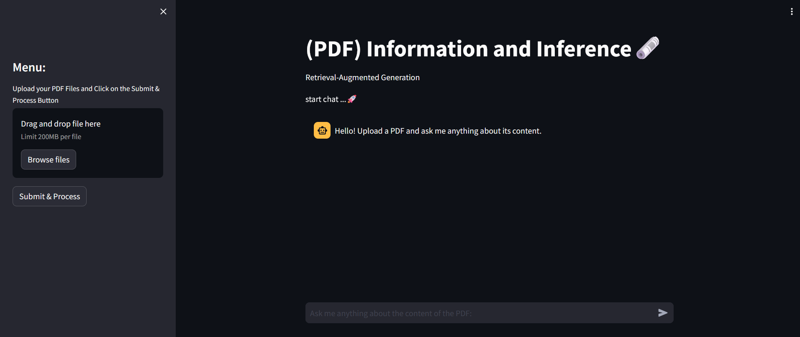
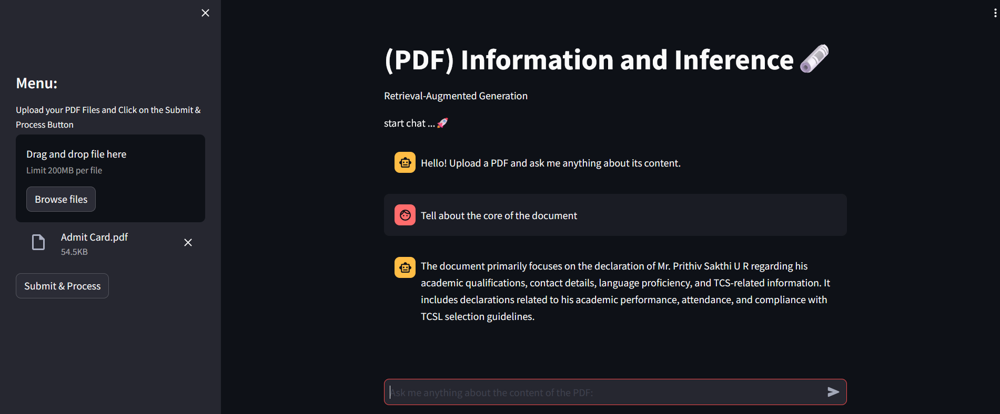

## Retrieval-Augmented Generation [ RAG ] 

---
title: RAG PDF CHATBOT
emoji: 😻
colorFrom: indigo
colorTo: purple
sdk: streamlit
sdk_version: 1.33.0
app_file: app.py
pinned: false
license: creativeml-openrail-m
---

🚀Check out the configuration reference at : https://huggingface.co/docs/hub/spaces-config-reference

🚀Huggingface space : https://huggingface.co/spaces/prithivMLmods/RAG-PDF-CHATBOT

🚀To Clone Just Install Git Past the Command : git clone https://huggingface.co/spaces/prithivMLmods/RAG-PDF-CHATBOT

ℹ️Generated Result in Huggingface Spaces:

ℹ️Upload the PDF & Submit Process

🔮Prompt : " Tell about core of the document. "

.

.

.

.
